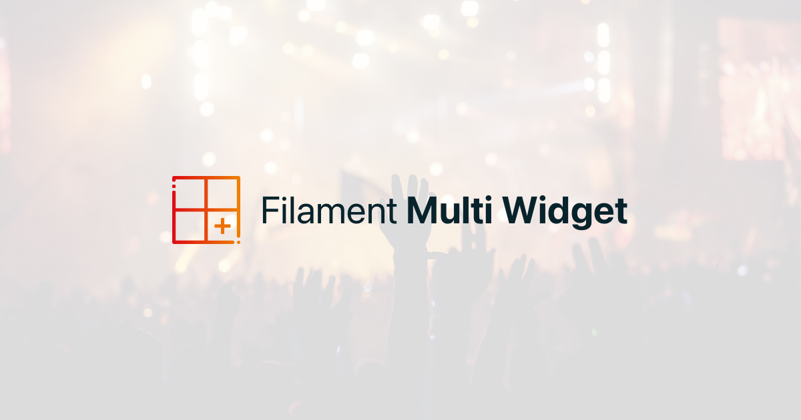
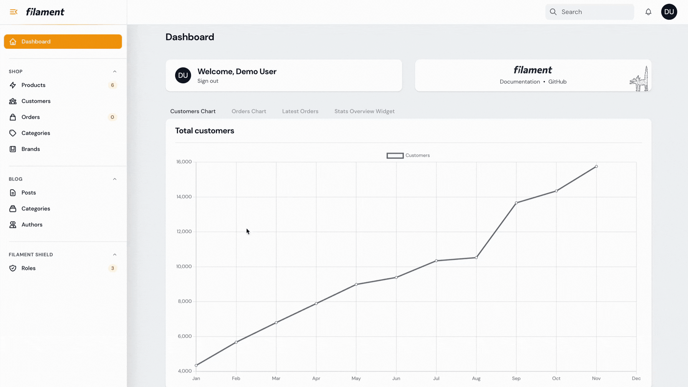
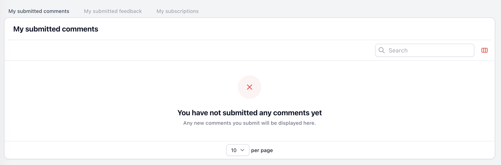

# Combine multiple widgets into one

[](https://github.com/vodafoneziggonl/filament-multi-widget/releases)
[](https://packagist.org/packages/vodafoneziggonl/filament-multi-widget)

This package adds a new type of widget to your Filament application. The Multi Widget allows you to combine multiple widgets into a single widget, that can be switched using tabs. This plugin helps clean up your Filament dashboard.



## Installation

This package can be installed via Composer:

```bash
composer require vodafoneziggonl/filament-multi-widget
```

## Usage

Create a new Multi Widget by extending the `VodafoneZiggoNL\MultiWidget\MultiWidget` class.

```php
// app/Filament/Widgets/UserMultiWidget.php

class UserMultiWidget extends MultiWidget
{
    public array $widgets = [
        MySubmittedComments::class,
        MySubmittedFeedback::class,
        MySubscriptions::class,
    ];
}
```

The `$widgets` property contains the classes of all the widgets that should be added to your Multi Widget. These are normal [Filament widgets](https://filamentphp.com/docs/2.x/admin/resources/widgets) that you created.  
The Multi Widget above will now render as follows:  



In case your widget is displayed a second time on the dashboard, make sure the widget is not automatically added to the dashboard again. Check the `discoverWidgets()` function in your `adminPanelProvider.php` file.

## Using custom labels for tabs

By default, the label name is generated based on the class name. If you want to customize the label for the tab, add the `getDisplayName()` method to your widget.

```php
// app/Filament/Widgets/ProductSales.php

class ProductSales extends BaseWidget
{
   // Some widget content...
   
    public function getDisplayName(): string {
        return "Custom name";
    }
}
```


## Persist tabs in session
To persist the tabs in the user's session, use the shouldPersistMultiWidgetTabsInSession() method:

```php
// app/Filament/Widgets/UserMultiWidget.php

class UserMultiWidget extends MultiWidget
{
    public array $widgets = [
        MySubmittedComments::class,
        MySubmittedFeedback::class,
        MySubscriptions::class,
    ];
    
    public function shouldPersistMultiWidgetTabsInSession(): bool
    {
        return true;
    }
}
```

## Contributing

Please see [CONTRIBUTING](https://github.com/vodafoneziggonl/.github/blob/main/CONTRIBUTING.md) for details.

## Credits

- [musa11971](https://github.com/musa11971)
- [Jehizkia](https://github.com/jehizkia)
- [All Contributors](../../contributors)

## License

The Apache License 2.0. Please see [License File](LICENSE.md) for more information.
